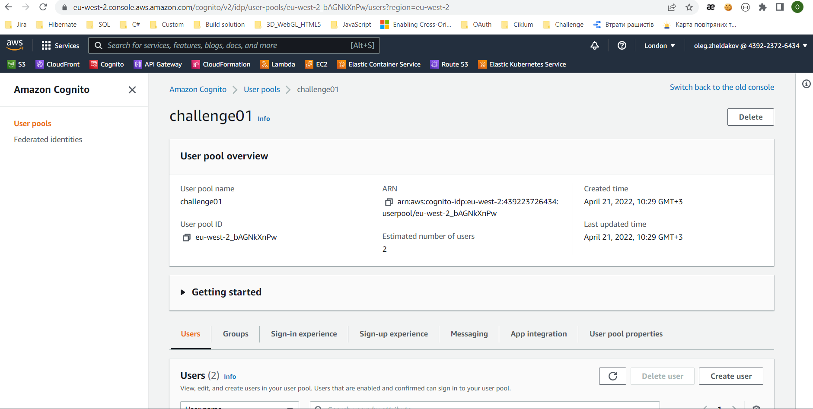
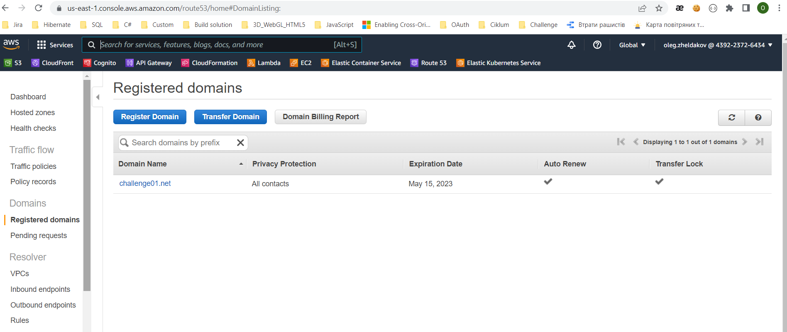
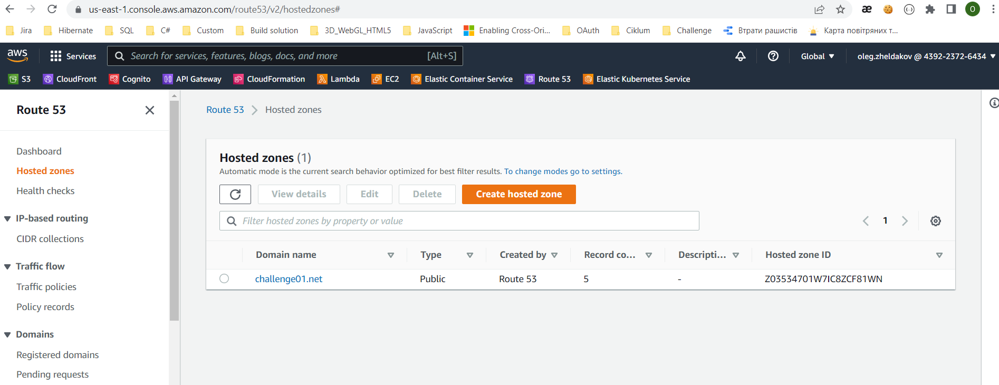
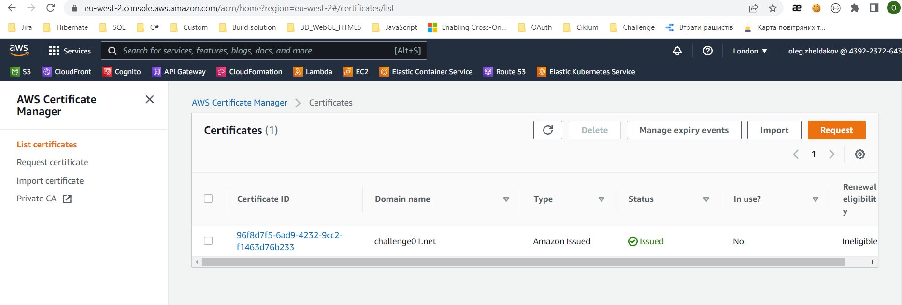
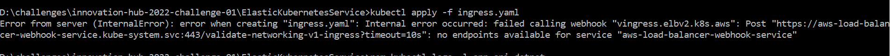

 One click deploy kubernate image to new AWS cluster
=============

# Goals:
## - one click create a new EKS
## - EKS can autoscaling by memory or CPU usages
## - EKS has endpoints of Load Balancer with authorized calls
## - EKS has endpoints of Load Balancer with anonymous calls
#

# 1. Autoscaling
Description: 
- https://www.kubecost.com/kubernetes-autoscaling/kubernetes-cluster-autoscaler/
#### Implementation:
- install metric server -> 
    cluster-up.cmd ->
    kubectl apply -f https://github.com/kubernetes-sigs/metrics-server/releases/latest/download/components.yaml
- install autoscaler ->
    0-cluster-autoscaler.yaml
- used autoscaler ->
    1-apiDotnet.yaml
#
# 2.Load Balancer authorizes by Cognito
Description:
- https://aws.amazon.com/blogs/containers/how-to-use-application-load-balancer-and-amazon-cognito-to-authenticate-users-for-your-kubernetes-web-apps/
- https://kubernetes-sigs.github.io/aws-load-balancer-controller/v2.4/guide/tasks/cognito_authentication/
#### Implementation:
- preconfigured
    - ### Cognito User Pool 
    - ### Route 53 -> Domain 
    - ### Route 53 -> Hosted zones 
    - ### SSL certificate 
- install external DNS ->
    externalDNS-up.cmd
- install Load Balancer Controller ->
    loadBalancer-up.cmd
    - list of types [load balancer](https://docs.google.com/spreadsheets/d/191WWNpjJ2za6-nbG4ZoUMXMpUK8KlCIosvQB0f-oq3k/edit#gid=907731238)
- configure ingress -> 1-StartApps.cmd -> kubectl apply -f ingress.yaml
```
spec:
  ingressClassName: alb
  rules:
    - host: challenge01.net 
      http:
        paths:
          - path: /api/freeget          ** this method can be called anonymously by http not https **
            pathType: Prefix
            backend:
              service:
                name: api-dotnet
                port: 
                  number: 80
          - path: /
            pathType: Prefix
            backend:
              service:
                name: ssl-redirect
                port: 
                  name: use-annotation
          - path: /                     ** other methods require authorization **
            pathType: Prefix
            backend:
              service:
                name: api-dotnet
                port: 
                  number: 80

```
#
# 3. One click deploy
- create a new cluster and configure -> all-start.cmd
- delete all source -> all-down.cmd
# 4. Notes
- ### If your have error 
you need recall comand:
```
kubectl apply -f ingress.yaml
```